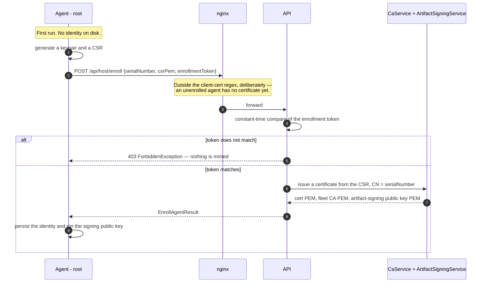
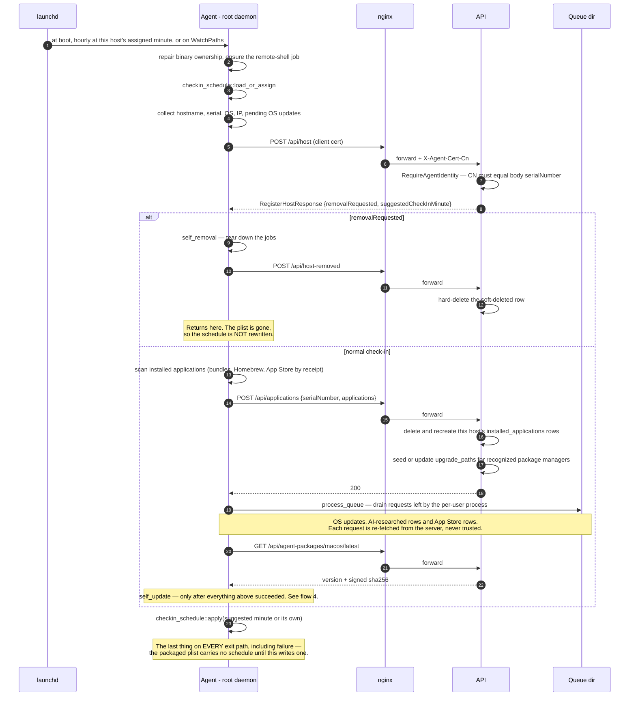
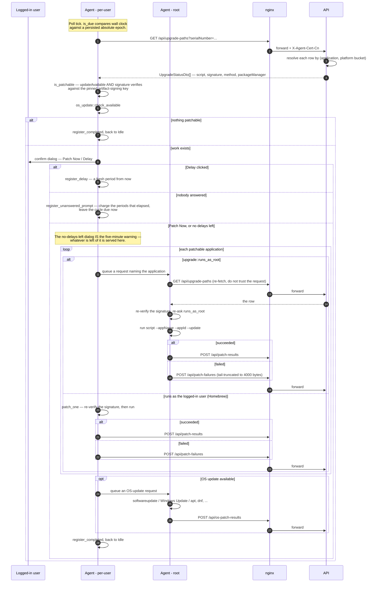
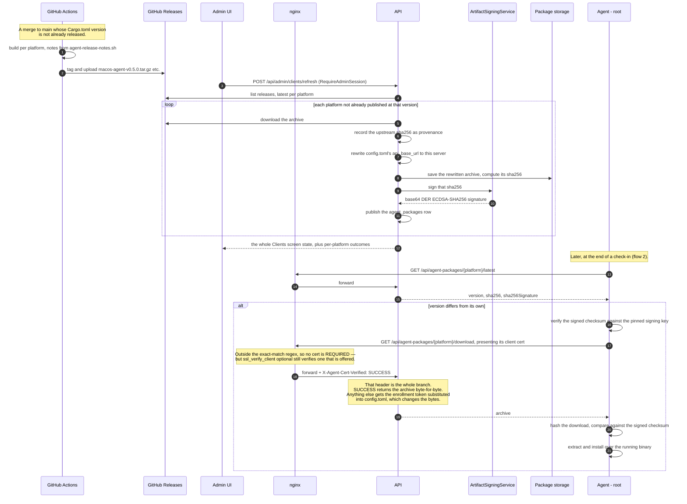
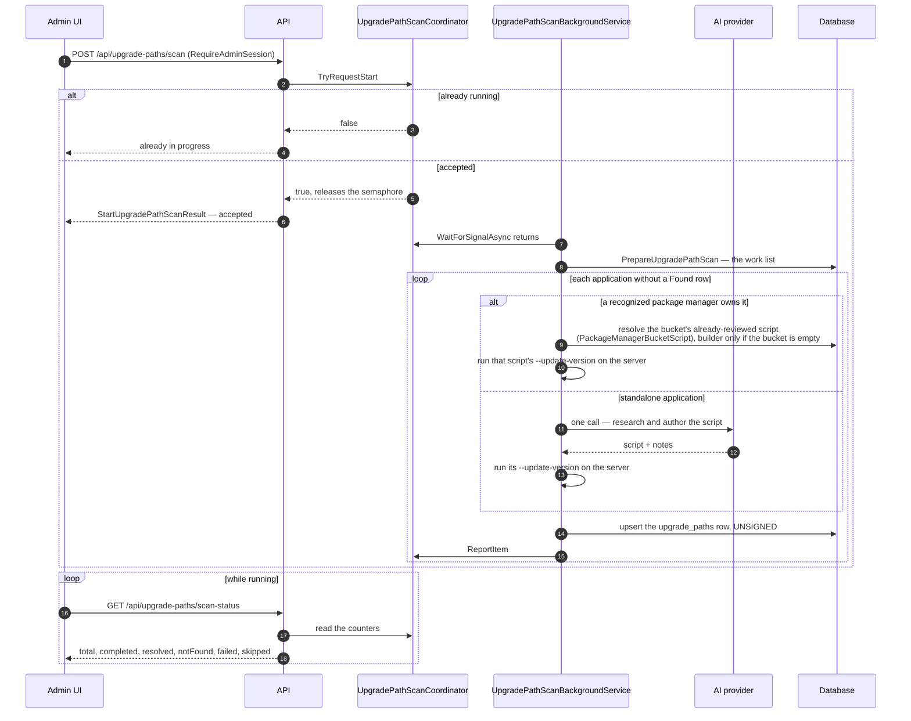
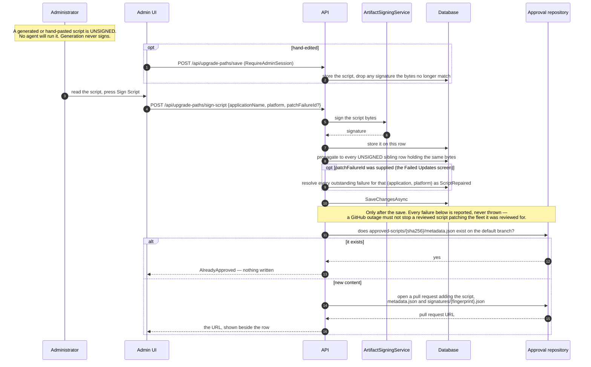
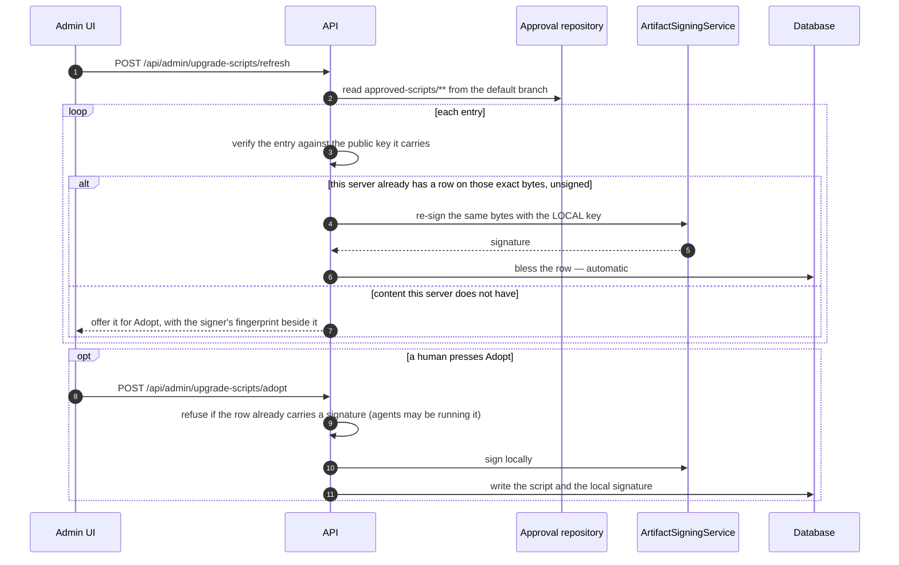
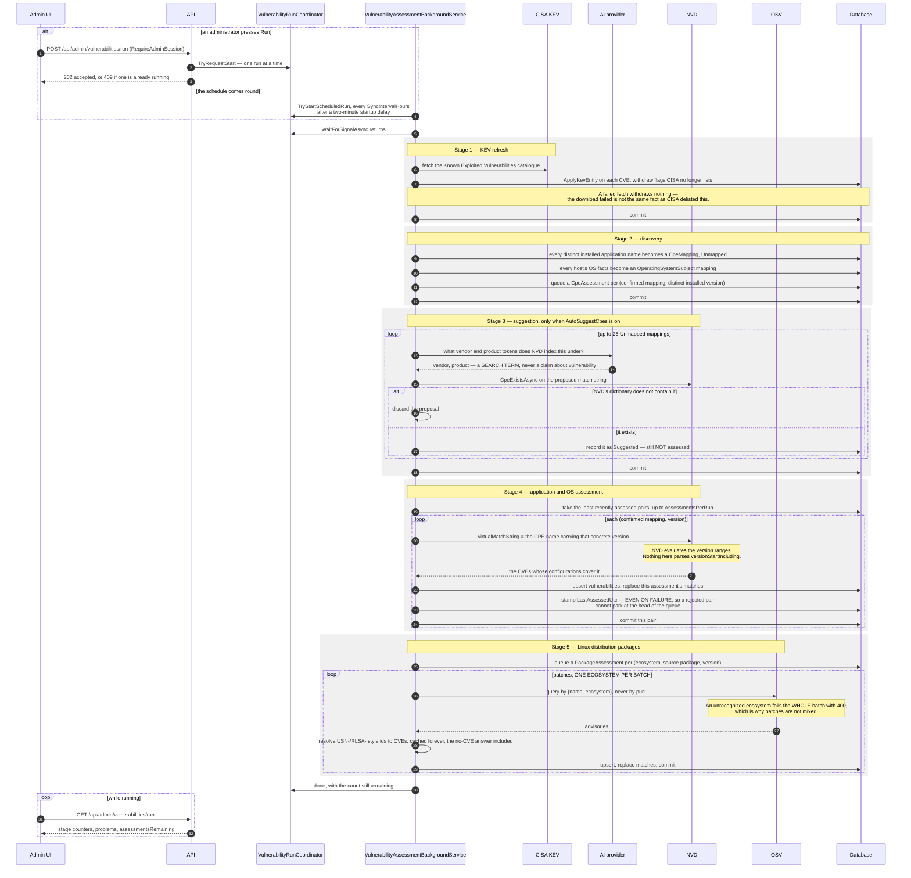
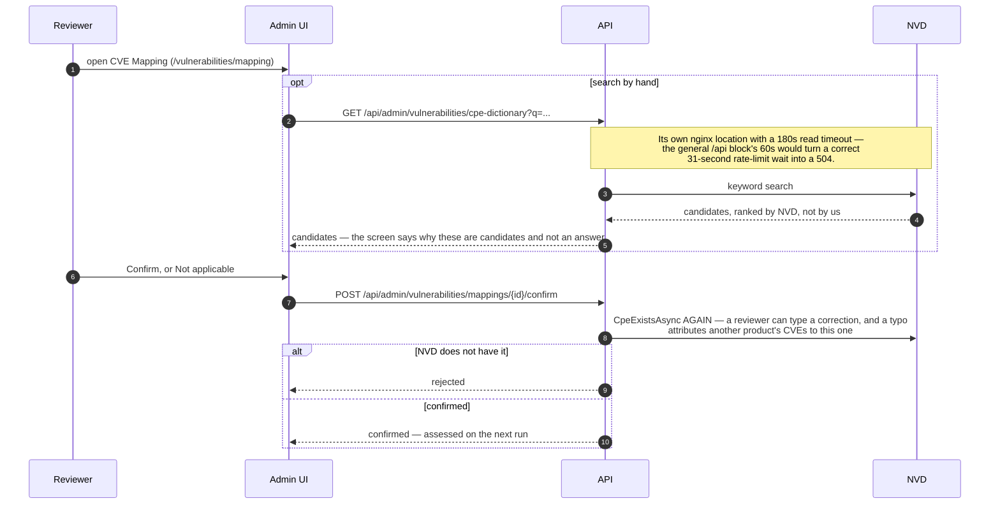

# Architecture: the flows

This file is the *shape* of the system — who talks to whom, in what order, and where a step can
stop. The **reasoning** behind each decision lives in the `CLAUDE.md` beside the code
(`src/`, `web/`, `clients/`, `nginx/`, and each agent's own), and this file names those rather than
restating them. Where a diagram and a `CLAUDE.md` disagree, the `CLAUDE.md` is the one that has
been kept current by the people editing that code.

Six flows are drawn: an agent **enrolling**, an agent **checking in**, an agent **patching**, and
on the server side **client updates**, **script creation and approval**, and **vulnerability
management**. Remote control, the Vanta sync and audit shipping are out of scope here; see
`src/CLAUDE.md` and `clients/CLAUDE.md`.

## The participants

| | |
|---|---|
| **Agent (per-user)** | Menu-bar / tray process. Decides *when* to patch, shows the dialogs. On macOS it holds the fleet identity; on Windows and Linux it holds none and makes no network call. |
| **Agent (root)** | LaunchDaemon (macOS), Windows service, systemd oneshot (Linux). Enrols, checks in, and runs whatever needs privilege. |
| **nginx** | Terminates TLS, verifies the agent's client certificate against the fleet CA, and forwards the verified CN as `X-Agent-Cert-Cn`. Also serves the compiled Flutter bundle. |
| **API** | ASP.NET Core 8, Clean Architecture, MediatR handlers. |
| **Coordinator + background service** | In-memory, one run at a time. Every long server-side job is started by a `POST` and watched by polling a `*-status` route. |
| **Admin UI** | Flutter web, served as static files by nginx. It polls; nothing is pushed to it. |

**Every agent arrow in this file goes through nginx, and that is the authentication.** nginx
requires a client certificate on an *exact-match* regex —
`^/api/(host|applications|patching-policy|upgrade-paths|patch-results|os-patch-results|host-removed)$`
— and `[RequireAgentIdentity]` then compares the forwarded CN against the `serialNumber` in the
request body, so a valid certificate cannot report data for another host. A route missing from that
regex is certless, and nothing in the C# will say so. See the root `CLAUDE.md` and `nginx/CLAUDE.md`.

---

## 1. Enrolment: the one route with no certificate

Two key hierarchies, kept apart on purpose: `CaService` mints *identities*,
`ArtifactSigningService` signs *content*. The pinned signing key is the only key an agent will ever
verify a script against — which is why an imported approval is re-signed locally rather than
relayed (flow 5c). The serial number **is** the identity: Windows and Linux screen it against a
placeholder list and refuse to enrol rather than invent one. See `src/CLAUDE.md` and
`clients/CLAUDE.md`.

---

## 2. Check-in

Drawn in the macOS shape, which is the only one with two processes and a queue between them. The
platform deltas are tabled below the diagram.

Four things that are easy to draw wrong and are load-bearing:

- `suggestedCheckInMinute` comes **back from the server**, which is how check-in load is spread
  across the hour. The agent adopts it.
- `checkin_schedule::apply` runs on the failure path too. A first run that failed used to return
  early and leave the host with nothing to retry it until a reboot.
- `self_update` runs **last**, and only after registration and inventory succeeded.
- The row a `removalRequested` host confirms is soft-deleted, not gone. An agent that cannot
  authenticate can neither learn it should uninstall nor confirm, so the row lingers holding its
  hostname and serial in unique indexes — see `ReclaimHostnameAsync` in `src/CLAUDE.md`.

### What differs per platform

| | macOS | Windows | Linux |
|---|---|---|---|
| Who checks in | root LaunchDaemon, re-invoked by launchd | resident service | systemd oneshot on a `.timer` |
| Who holds the identity | the **per-user** process has it too | root only | root only |
| Patching policy | the per-user process fetches it (`policy::load_or_fetch`) | root fetches on every check-in, writes `policy.json` `0644`; per-user only `load_cached`s | same as Windows |
| Nobody logged in | nothing patches | shell reachable, nothing patches | **the root service patches unattended** when the per-user heartbeat is stale |
| Inventory | bundles + Homebrew + App Store | uninstall registry (3 views) + winget + Chocolatey | Flatpak + Snap as applications; dpkg/rpm reported separately as `packages` |
| Extra OS facts | none — `sw_vers` already exact | `CurrentBuildNumber` + `UBR` | os-release `ID` + `VERSION_ID` |

The macOS per-user fetch is the deliberate exception, and only because that process holds an
identity. Reintroducing a per-user fetch on Windows or Linux reproduces the 0.5.0 bug where every
Linux host with a desktop 403'd once a minute while reporting healthy check-ins — see
`clients/CLAUDE.md`.

---

## 3. Patching

- **The signature is verified twice on purpose.** `is_patchable` filters the work list;
  `patch_one` re-verifies immediately before executing. The one function that actually runs
  something is the one that must never skip the check.
- **Only the process that ran the script reports the result.** `runs_as_root` is the branch;
  reporting from both sides would record every root-run failure twice.
- **Only a real execution failure reaches `/api/patch-failures`.** No identity, no signed
  patchable path, the daemon's `runs_as_root` refusal, an unreachable server, an OS update — those
  are configuration problems or have no script to repair, and a queue full of them hides the ones
  the AI can fix.
- A `PatchFailure` is **one row per (host, application)**, folded on repeat with a first-seen date
  and a count. `Platform` is resolved by the server, never sent by the agent.

Where a failure goes next is flow 5: the Failed Updates screen's fix panel appends the captured
output and the current script to the ordinary research prompt, and signing the repair resolves
every outstanding failure for that (application, platform).

---

## 4. Client updates: getting a new agent build onto the fleet

Two halves that meet at `agent_packages`. CI publishes to GitHub Releases and never touches the
server; the server **pulls**.

- `/api/agent-packages` is anonymous **by design**: a self-updating agent has to see what is
  published before it can prove anything, and the signed checksum is the protection. The
  enrollment-token rewrite is why an anonymous download and an agent download are different bytes,
  and why only the agent's copy can match the signed hash.
- Replacing a running binary differs: macOS and Linux stage beside the target and rename over it;
  Windows renames the *old* image aside, copies in, and deletes the displaced copy at next service
  start, restoring the old one if the copy fails.
- `/api/admin/clients/windows/bootstrap-script` renders a live `AGENT_ENROLLMENT_TOKEN` into a
  silent installer, which is exactly why it sits under `/api/admin/` behind `[RequireAdminSession]`.
- A version bump is half a `Cargo.toml` edit and half a regenerated `Cargo.lock`; CI passes
  `--locked` everywhere, so a bump missing the lock dies before compiling and the tag is silently
  never cut. See `clients/CLAUDE.md`.

---

## 5. Script creation, signing and approval

### 5a. Finding a script

`POST` + poll a `*-status` route is the shape of **every** long server-side job here: the scan
above, `check-updates`, a single-row `refresh`, and the vulnerability run in flow 6. The UI polls
because the coordinators were built to be polled; there is no push channel. See `web/CLAUDE.md`.

An AI-researched row lives under an OS bucket (`macOS`, `Windows`, `Linux`); a package-manager row
lives under its manager's bucket (`pm:Homebrew`, `pm:winget`, ...), because what a `brew upgrade`
row depends on is the manager, not the OS. Every builder returns **byte-identical** content for
every application — the name and id arrive as `--appName`/`--appId` at runtime — which is what lets
one review cover every application a manager handles.

### 5b. Signing, and what a signature reaches

- **The pull request is a record and a distribution channel, not a gate.** The signature is
  effective locally the moment it is saved — the human at the console reviewed it.
- **The default branch is the trust root, and nothing else is.** The signer's public key travels in
  the same repository as the script it vouches for, so verifying an entry proves it is internally
  consistent and *names* its signer, not that the signer was authorized. Branch protection on that
  branch is the only real control. The UI says so; keep it saying so.
- Layout is content-addressed because a package-manager script is byte-identical across every
  application that manager handles, so one review covers all of them; one signature file per signer
  means two servers approving the same bytes never conflict.

### 5c. Taking an approval from another server

**A remote signature is never served to an agent.** Each agent pinned exactly one signing key at
enrolment — its own server's — so the importing server re-signs the same bytes locally. That is why
this feature needed no change in any of the three agents.

Blessing is automatic because no new content arrives; adoption is a button because a merge to that
repository is enough to *offer* new executable content to every server that refreshes.
`TakeServerWrittenScript` — for when a deployment's builder text differs from what a bucket runs —
writes the new text **unsigned** for the same reason.

---

## 6. Vulnerability management

One bounded, resumable run. Five stages, each committing before the next, and **a failing stage does
not abort the run** — they fail for unrelated reasons, and an unconfigured AI provider must not stop
a KEV refresh that needs no AI.

### The human step in the middle

Nothing is assessed until a person confirms the mapping. The queue lives on the Vulnerabilities
screen because that is where an empty one gets fixed.

### Facts the diagrams above depend on

- **NVD evaluates the version ranges.** Handing `virtualMatchString` a CPE name carrying a concrete
  version returns only the CVEs whose configurations cover it. Re-implementing that matching locally
  would be a second, divergent opinion about which versions a CVE affects.
- **Linux distribution packages go to OSV, never to NVD's CPE ranges.** Distributions backport
  security fixes without changing the upstream version, so a CPE match on a dpkg version reports
  CVEs fixed months ago. The name queried is the **source** package (`openssl`, not `libssl3`).
- **A package needs no mapping queue.** "slack" could be Slackware; a distribution's own source
  package name is unambiguous, so packages produce findings the moment they are reported. A
  Linux-only fleet therefore has real coverage with zero confirmed mappings.
- **A KEV entry cannot tell you whether you are affected** — CISA's catalogue has no version ranges
  at all, so `KnownExploited` is only ever an overlay on a match NVD's ranges already produced.
- **`NvdRateLimiter` is a singleton because the limit belongs to the server**, not to a component.
  NVD counts per source address and answers an overrun with a 403, which reads like an auth failure.
- **Coverage this feature does not have is a first-class number.** `UnmappedSubjectCount` and
  `UnassessableHostCount` ride beside the findings, and an empty table distinguishes "nothing found"
  from "nothing looked at". Windows refuses to assess without the update revision rather than
  assuming `.0`, because `10.0.22631.4317` answers 1355 CVEs where `.6000` answers 793.

---

## Where to read next

| Flow | Owning file |
|---|---|
| Layering, auth gap, buckets, approval, vulnerability assessment | `src/CLAUDE.md` |
| Polling, tables, enums on the wire, the Vulnerabilities screens | `web/CLAUDE.md` |
| Queue, check-in scheduling, patch cycles, per-platform differences | `clients/CLAUDE.md` and each agent's own |
| Location precedence, client-certificate verification, 495/496 | `nginx/CLAUDE.md` |
| Couplings with two ends in different directories | `.claude/rules/` |
